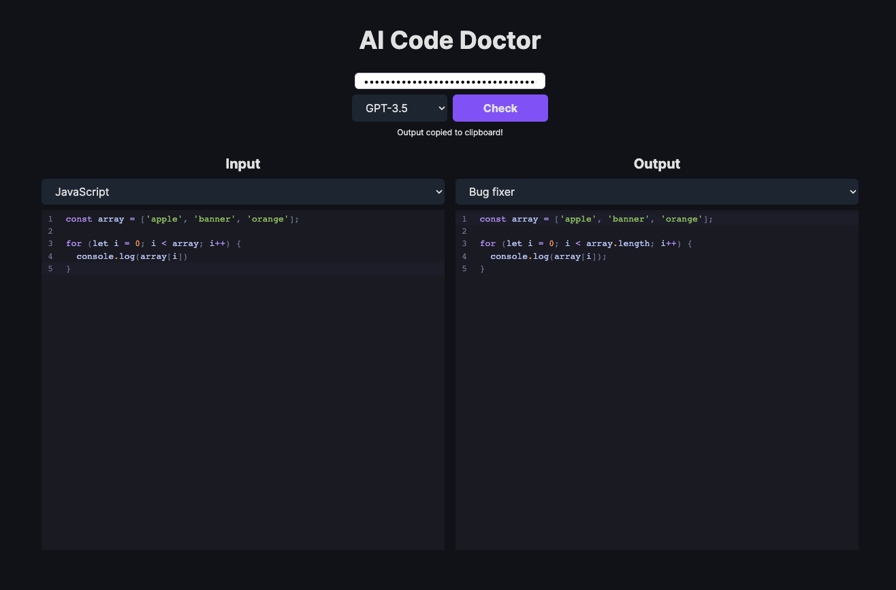

# AI Code Doctor
Let AI be your code doctor, helping you quickly resolve code defects, explaining complex code segments, and even refactoring your code.



## Running Locally

**1. Clone Repo**

```bash
git clone https://github.com/CharleeWa/ai-code-doctor.git
```

**2. Install Dependencies**

```bash
pnpm install
```

**3. Run App**

```bash
pnpm dev
```

## Credits

- [ai-code-translator](https://github.com/mckaywrigley/ai-code-translator)
